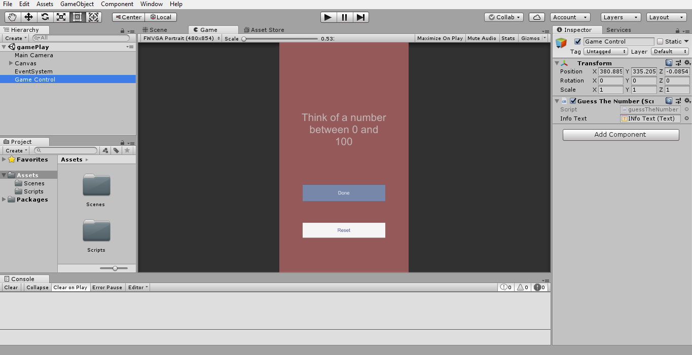
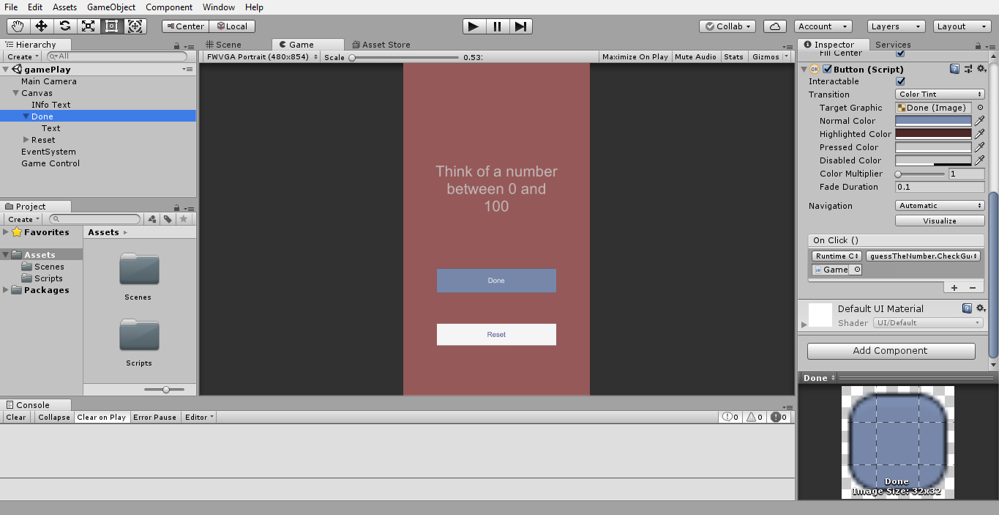

# 2DnumberGame
Unity2D game based on text manipulation and to trick your friends

Create GameObject
- UI-Text
- UI-Button(Done)
- UI-Button(Reset)
- Empty GameObject(GameController)

Go to inspector of empty gameobject and go to Add component and add new Script to it and name it as `gameController.cs`. 
#### Copy the code from the above gameController C# script in Repo and Add to this file
</img>

Make the changes as given in the screenshot above using the drag and drop of gameobjects in the scripts
</img>